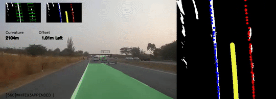
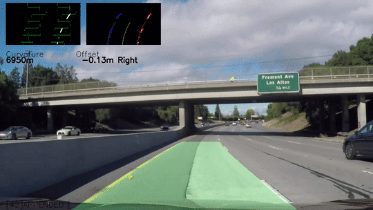
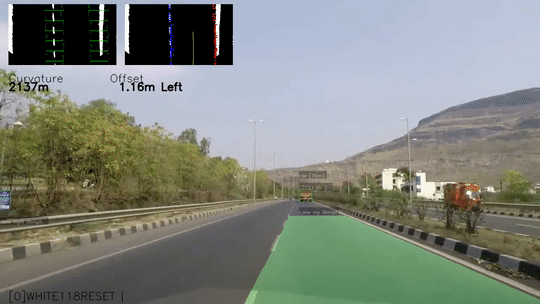

# Copilot : Driving assistance on mobile devices
### Lane and obstacle detection for active assistance during driving.


<br> 
*Vehicle* *Position* *+* *collision* *time* *superposed* *in* *the* *top* *view* 

Accompanying article https://towardsdatascience.com/copilot-driving-assistance-635e1a50f14


Global annual road accidents fatalities total about 1.5 million which is just about the population of Mauritius. 90% of these occur in low and middle income countries which have less than half of the total vehicles in the world. Advanced driver-assistance systems (ADAS) Lane detection, collision warning are present in less than 0.1% of the vehicles. They are almost non existent in developing countries.
Median Smartphone ownership in emerging economies is about 10 times as high as that of four wheeler. While we already have semi autonomous vehicles running about in parts of the world. This repository checks how close we might come to using a mobile computing platform as an ADAS copilot. 

## DOWNLOAD WEIGHTS AND CODE

```python
! git clone https://github.com/visualbuffer/copilot.git
! mv copilot/* ./
! wget -P ./model_data/ https://s3-ap-southeast-1.amazonaws.com/deeplearning-mat/backend.h5
```

<br>
*Robustness* *for* *different* *illumination* *conditions*z 

## USAGE EXAMPLE
```python
from frame import FRAME

file_path =  "videos/highway.mp4"# <== Upload appropriate file          
video_out = "videos/output11.mov"
frame =  FRAME( 
    ego_vehicle_offset = .15,                       # SELF VEHICLE OFFSET
    yellow_lower = np.uint8([ 20, 50,   100]),      # LOWER YELLOW HLS THRESHOLD
    yellow_upper = np.uint8([35, 255, 255]),        # UPER YELLOW HLS THRESHOLD
    white_lower = np.uint8([ 0, 200,   0]),         # LOWER WHITE THRESHOLD
    white_upper = np.uint8([180, 255, 100]),        # UPPER WHITE THRESHOLD
    lum_factor = 118,                               # NORMALIZING LUM FACTOR
    max_gap_th = 0.45,                              # MAX GAP THRESHOLD
    YOLO_PERIOD = .25,                              # YOLO PERIOD
    lane_start=[0.35,0.75] ,                        # LANE INITIATION
    verbose = 3)                                    # VERBOSITY
frame.process_video(file_path, 1,\
        video_out = video_out,pers_frame_time =144,\
        t0  =144 , t1 =150)#None)
```
| PARAMETER  | Description |
| ------------- | ------------- |
|SELF VEHICLE OFFSET| Trim off from bottom edge video if ego vehicle covers part of the frame % of front view|
| LOWER YELLOW HLS THRESHOLD  | Lower yellow HLS threshold used to prepare the mask. Tune down if yellow lane is not detected, up if all the foilage is  |
| UPPER YELLOW HLS THRESHOLD | Upper threshold for identifying yellow lanes |
|LOWER WHITE THRESHOLD| Lower yellow HLS threshold used to prepare the mask. Tune up  saturation if  foilage lights up the entire scene  |
|UPPER WHITE THRESHOLD| |
|NORMALIZING LUM FACTOR| Factor used to normalize luminosity against, reducing increses lower Lum threshold |
|MAX GAP THRESHOLD| Max continous gap tollerated in the lane detection % of top-view height |
|YOLO PERIOD| Period [s] after which YOLO is detected, typ 2s reducing decreases processing fps increases detection|
|LANE INITIATION| intial guess for lane start % of top-view width|
|VERBOSITY|1 Show lesser,2 Show less,3 Show everything |

<br>
*Detecting* *lane* *change* *automatically*


## Notebooks
| DIRECTORY  | COLAB |
| ------------- | ------------- |
|./notebooks/coPilot.ipynb|https://colab.research.google.com/drive/1CdqDXZqssDgSC35W4A-4Gp8kfqzyPKug|

The front of the dashboard is one hot place. Even when we run a gps and sync music a phone is hot to touch after the 5 hour drive. But phones are getting better faster, rugged, efficient and generate less heat. Unlike the human driver a mobile device does not get fatigued, and works consistently. Algorithms may not be as smart as humans when faced with ambiguity but as we have seen above algorithms have the potential to bring significant improvements to our day to day commute.


